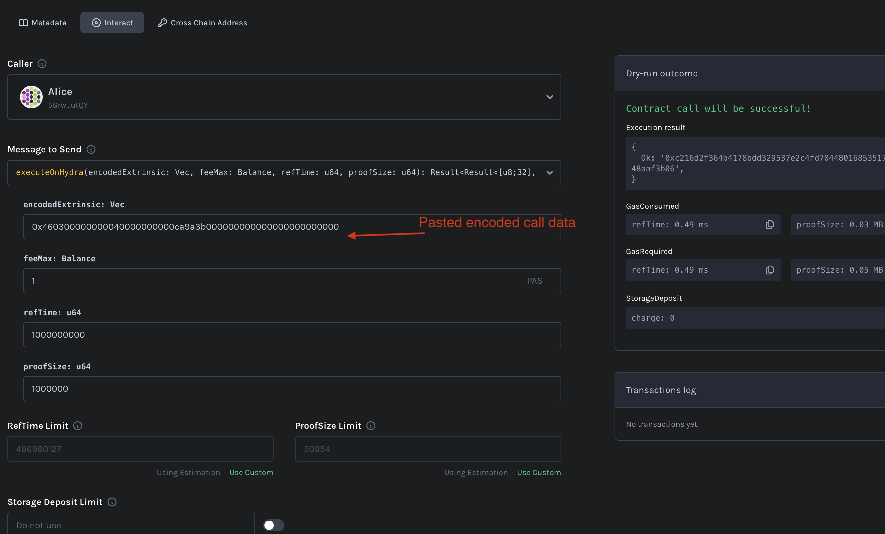

# Simple Example For Executing and Reading from Hydra

This is a guide to execute a smart contract that generically uses Hydration. It supports an arbitrary encoded call data to perform a `Transact` on Hydration.
Additionally, it allows querying an arbitrary storage key from the contract.

The smart contract on Pop will control an account on Hydration which will require HDX to pay the fees. 

1. Add existing contract on Pop https://contracts.onpop.io/add-contract  
  - Use this metadata [./execute_on_hydra_metadata.json](./execute_on_hydra_metadata.json)
  - Use this contract address: `13ekCGKXooHstd3C4kaJMyX5KAsqW6P4W8GJzUCEfApNaxD9`

2. On [Hydration](https://polkadot.js.org/apps/?rpc=wss%3A%2F%2Fpaseo-rpc.play.hydration.cloud#/extrinsics) create an extrinsic and copy its encoded call data

3. Make sure the contract's account on Hydration has HDX to pay fees. You can find this account in the "Cross Chain Address" tab.

4. Create the smart contract call at https://contracts.onpop.io/contract/13ekCGKXooHstd3C4kaJMyX5KAsqW6P4W8GJzUCEfApNaxD9
  - Use the encoded call data from step 2

  - Verify any events on Hydration to make sure the transaction was successful. In further examples we can use query responses from XCM and callback the contract.

5. Get storage key to query from Hydration https://polkadot.js.org/apps/?rpc=wss%3A%2F%2Fpaseo-rpc.play.hydration.cloud#/chainstate

6. Get the latest ISMP height (block number) for Hydration. You can do check this from Pop's events. 

7. Create the smart contract call at https://contracts.onpop.io/contract/13ekCGKXooHstd3C4kaJMyX5KAsqW6P4W8GJzUCEfApNaxD9
  - Use the storage key from step 5
  - Use the ISMP height from step 6

